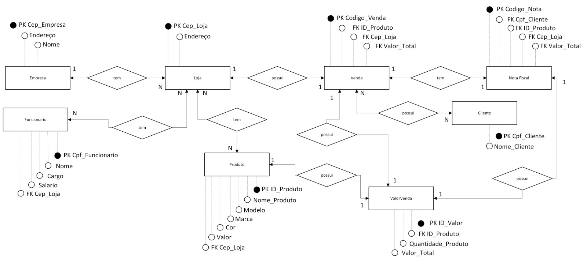
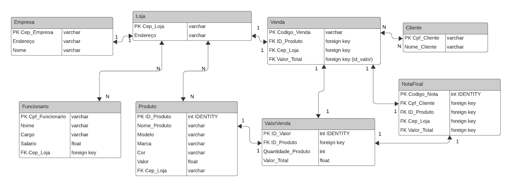

## Sistema de Venda 🛒 - Banco de Dados SQL Server 🗃️

  <!-- Contador de linguagens do GitHub -->
  
  <!-- Tamanho do repositório no GitHub -->
  
  <!-- Licença do GitHub -->
  

  

## Objetivo 🎯
Este repositório contém o código SQL para a criação de um banco de dados relacional para um sistema de **ponto de venda (PDV)**, desenvolvido para a **NP1** do quarto semestre, utilizando a linguagem SQL e o SGBD **Microsoft SQL Server**. O banco de dados foi projetado para armazenar informações essenciais para o funcionamento de um **PDV**, como: **empresa**, **lojas**, **produtos**, **vendas**, **valor da venda** e **notas fiscais**. 

Aqui está um resumo parcial das tabelas:

* **Empresa:** Informações sobre a empresa, incluindo nome e endereço.
* **Loja:** Informações sobre as lojas, incluindo CEP e endereço.
* **Produto:** Informações sobre os produtos vendidos, incluindo nome, modelo, marca, cor, valor e a loja em que estão cadastrados.
* **Funcionário:** Informações sobre os funcionários, incluindo CPF, nome, cargo, salário e loja em que trabalham.
* **Valor da Venda:** Informações sobre o valor total da venda, incluindo o produto, a quantidade vendida e o valor total.
* **Venda:** Informações sobre as vendas, incluindo código da venda, produto vendido, loja e valor total.
* **Cliente:** Informações sobre os clientes, incluindo CPF e nome.
* **Nota Fiscal:** Informações sobre as notas fiscais, incluindo código da nota, cliente, produto e loja. 

  
## Desenvolvimento 🏗️
O desenvolvimento do banco de dados para o sistema de PDV seguiu as seguintes etapas:

**1. Modelagem de Dados:**
* **Criação do MER (Modelo Entidade-Relacionamento):** Nesta etapa, foi definido o modelo conceitual do banco de dados, representando as entidades (tabelas) e seus relacionamentos.
* **Criação do DER (Diagrama Entidade-Relacionamento):** A partir do MER, foi elaborado o DER, que representa a estrutura física do banco de dados, incluindo as tabelas, atributos e suas relações.

**2. Implementação em SQL:**
* **Criação das tabelas no Microsoft SQL Server:** As tabelas foram criadas no SGBD Microsoft SQL Server, com base no DER, definindo os nomes das tabelas, atributos e seus tipos de dados.
* **Definição das chaves primárias e estrangeiras:** As chaves primárias e estrangeiras foram definidas para garantir a integridade referencial e a consistência dos dados.
* **Inserção de dados de exemplo nas tabelas:** Dados de exemplo foram inseridos nas tabelas para testar a funcionalidade do banco de dados e demonstrar sua estrutura.
Com essas etapas, o banco de dados para o sistema de PDV foi desenvolvido de forma completa e organizada, garantindo a estrutura e a funcionalidade necessárias para o sistema.

### MER (Modelo Entidade-Relacionamento) 🗺️
Ele representa a estrutura conceitual do banco de dados, mostrando as entidades (tabelas) e seus relacionamentos. 

  

### DER (Diagrama Entidade-Relacionamento) 📊
Ele representa a estrutura física do banco de dados, mostrando as tabelas, atributos e suas relações.

  

 

## Estrutura do Banco de Dados 🗄️
O banco de dados é composto pelas seguintes tabelas:
* **Empresa:** Armazena informações sobre a empresa.
* **Loja:** Armazena informações sobre as lojas.
* **Produto:** Armazena informações sobre os produtos.
* **Funcionario:** Armazena informações sobre os funcionários.
* **Valor_Venda:** Armazena informações detalhadas sobre o valor de cada venda.
* **Venda:** Armazena informações gerais sobre cada venda.
* **Cliente:** Armazena informações sobre os clientes.
* **Nota_Fiscal:** Armazena informações sobre as notas fiscais.

## Como Usar 💻

**Para usar o banco de dados, siga estes passos simples:**
1. **Baixe e instale o Microsoft SQL Server:** [Link para download do Microsoft SQL Server](https://www.microsoft.com/en-us/sql-server/sql-server-downloads). 
2. **Configure o SQL Server** para acesso e **inicie uma nova consulta**. 
3. **Importe o código SQL** do arquivo `SistemaVendas.sql` para o banco de dados.
4. **Execute as instruções SQL** para criar as tabelas e inserir os dados de exemplo.
5. **Utilize as instruções SQL** para consultar, inserir, atualizar e excluir dados no banco de dados.

**Observações:**
* As chaves primárias **não autoincrementadas** são definidas como `NOT NULL`.
* As chaves estrangeiras usam a restrição `FOREIGN KEY`.
* Os dados de exemplo servem apenas para demonstração. 

## Possíveis Erros ⚠️
Estaremos corrigindo quaisquer **erros** encontrados no banco de dados. 

## Autores 👨‍💻👩‍💻
* Monique Domingues Mendes
* Ricardo Andreotti Gonçalves
* Guilherme da Costa Baptista
* João Pedro Oliveira da Silva

## Conclusão 🎉
Este projeto demonstra a criação de um banco de dados relacional para um sistema de **PDV**, utilizando a linguagem SQL e o SGBD **Microsoft SQL Server**. O banco de dados é capaz de armazenar e gerenciar informações essenciais para o funcionamento de um **PDV**, e pode ser utilizado como base para o desenvolvimento de um sistema de **PDV** completo.

## Licença 📄
Este projeto está licenciado sob a licença MIT.
